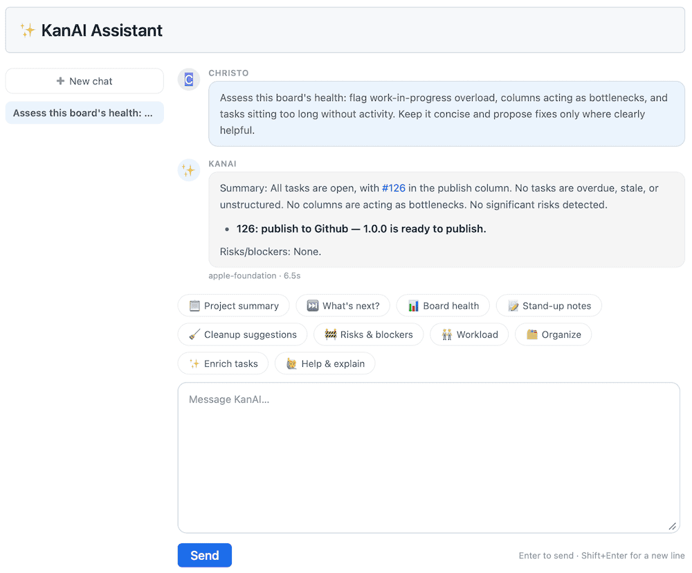

# KanAI AFM Bridge

*KanAI AFM Bridge* is a tiny OpenAI-compatible server that connects [KanAI](https://github.com/k1bot2026/kanboard-plugin-kanai) for [Kanboard](https://kanboard.org) and your Mac's built-in, on-device AFM model ([Apple Foundation Models](https://developer.apple.com/documentation/foundationmodels)).

KanAI talks to the bridge through its `local` provider the same way it talks to Ollama, LM Studio, vLLM, etc., so queries about your projects and tasks get answered privately on your Mac and get displayed in KanAI.

No queries or responses about your projects or tasks ever get sent to a third-party AI provider. *KanAI AFM Bridge* is just one Swift file that uses Apple Intelligence and the [Command Line Tools](https://developer.apple.com/documentation/xcode/command-line-tools).

[](screenshot.png) _Running KanAI's "Board health" command using the KanAI AFM Bridge with AFM (Apple Foundation Models)._


## Quick start

1. First, check for [Command Line Tools](https://developer.apple.com/documentation/xcode/command-line-tools). This command doesn't do anything if they're already installed, and it opens Apple's Command Line Tools installer if they aren't. Wait for the installer to finish before continuing.

```bash
xcode-select -p >/dev/null 2>&1 || { xcode-select --install; false; }
```

2. Install the bridge, run it at login, and check that it works:

```bash
git clone https://github.com/christefano/kanai-afm-bridge.git /path/to/kanai-afm-bridge && cd /path/to/kanai-afm-bridge && sh build.sh && sh launchd/install.sh && sleep 3 && sh test.sh
```

3. Then in Kanboard, Settings -> KanAI, set the provider to `local`, Base URL to `http://127.0.0.1:11437/v1`, and model to `apple-foundation`.

[INSTALL.md](INSTALL.md) covers the requirements, the install settings (port, SSH port, tunnel key, and bearer token), the restricted SSH key and reverse tunnel to a Kanboard server, login and restart behavior, recommended firewall rules, a reboot checklist for the tunnel port, and the cron command for KanAI's scheduled digest.

Uninstall:

```bash
sh /path/to/kanai-afm-bridge/launchd/uninstall.sh && rm -rf /path/to/kanai-afm-bridge && rm -f ~/Library/Logs/kanai-afm-bridge.log ~/Library/Logs/kanai-afm-bridge-tunnel.log
```


## Stop, start, and restart

| Command | Effect |
|---|---|
| `start` | Loads the bridge and the tunnel if they're stopped |
| `stop` | Unloads them until `start`, `restart`, or the next macOS login |
| `restart` | Stop, start, then status |
| `status` | Shows each agent and whether the bridge responds |
| `logs` | Last lines of the bridge's and tunnel's logs |
| `awake on` / `awake off` | Optional. Blocks idle sleep while the agents run. Off by default |

Run any of these with `launchd/ctl.sh`. This one shows the status:

```bash
sh /path/to/kanai-afm-bridge/launchd/ctl.sh status
```


## Context window and longer responses

Apple's ~3B parameter, on-device foundation model has a context window of [4096 tokens per session](https://developer.apple.com/documentation/foundationmodels/managing-the-context-window) with a token representing each word or partial word. It's printed as `contextSize` in the startup line. Set KanAI's max context tokens below it with room for the system prompt and `max_tokens`. A prompt over the limit returns HTTP 400 `context_length_exceeded`.

KanAI's command buttons ("Board health", "Project summary", etc.) and its system prompt ask for "concise" and "short" replies, and the on-device model follows them. The window is shared, so the reply can use whatever the prompt leaves. To get more:

- Type the length into the question: "Explain in detail with reasons in at least five paragraphs."
- Lower KanAI's max context tokens to leave more room at the cost of fewer tasks in view.
- Raise KanAI's max output tokens and its request timeout, too: replies arrive all at once, and a longer reply takes longer to generate. Time a long reply on your Mac (the log line has `reply_tokens` and the elapsed time) and set the timeout above it. Check `reply_tokens` in the log: `HIT_MAX_TOKENS` means the cap is the limit, and `SALVAGED` means the reply was cut off and recovered.

Longer replies from a model this small may also have more incorrect facts.

Even with a low max context setting, a long KanAI conversation can overflow the window. KanAI adds the last 10 turns of the conversation to the prompt on top of that budget (according to the KanAI 1.7.0 code), so the prompt can pass 4096 and KanAI shows "Prompt is N tokens but the on-device model context is 4096". Clearing the conversation in KanAI or starting a new one might fix it. Responses stay in the chat history and context, and a lower max output tokens setting increases the context more slowly.


## Internals

- Listens on `127.0.0.1:11437` (or change the port with `KANAI_AFM_BRIDGE_PORT`).
- `GET /v1/models` lists one model: `apple-foundation`.
- `POST /v1/chat/completions` responds from the on-device model. `system` messages become the session instructions.
- `response_format` of `json_object` adds a JSON-only instruction, pulls out the first balanced object, validates it, and retries once. A second failure is HTTP 502.
- A long response can hit `max_tokens` before the JSON closes. The bridge then recovers the `answer` string, drops any proposals (a half-written proposal shouldn't ever be applied), and returns `{"answer": ..., "proposals": []}`. The reply may end in the middle of a sentence, and the log line says `SALVAGED`. This applies only when the object never closed and the top-level key is `answer`.
- AFM is a small ~3B parameter model that tends to answer in one run-on line, so the bridge's JSON mode also adds a layout rule: line breaks as `\n`, one item per line, `-` list items, blank lines between paragraphs. A raw line break the model puts inside a JSON string is escaped before validation instead of costing a retry.
- AFM often ignores the layout rule, so the bridge reflows the top-level answer string one line at a time:
    - A line of 120 or more characters has its `;` items split into `-` lines.
    - Each `. Label:` starts a new paragraph.
    - A paragraph of 200 or more characters with no line breaks and at least two sentence breaks gets one sentence per paragraph.
    - A sentence with a single semicolon is left alone.
    - Other JSON fields are never changed, and the reply's key order can differ from the model's.
- Each chat reply has a header like `x-kanai-afm-bridge-context: 2870/4096`: the prompt's tokens over the model's context window. Use `curl -i` to show it and make tuning KanAI's max context and max output tokens easier.
- Each request logs the reply's token count. `HIT_MAX_TOKENS` means the reply reached `max_tokens` and was probably cut off.
- Failures are real HTTP errors like `{"error":{"message":...}}`. A failed run doesn't come back as an answer. Not supported: streaming (HTTP 400), chunked request bodies (HTTP 501), and anything except chat completions and the model list.


## Common errors

| Status and type | Cause | Fix |
|---|---|---|
| 503 `model_unavailable` | Apple's on-device AFM model isn't ready. | Turn on Apple Intelligence in System Settings and wait for the model download to finish. |
| 400 `context_length_exceeded` | The prompt is over the 4096 token window. | Lower KanAI's max context tokens or clear the conversation. |
| 502 `invalid_json` | The model returned no valid JSON object after two attempts. | Send the request again or shorten the question. |
| 504 `timeout` | The model didn't answer within 100 seconds. | Lower KanAI's max output tokens or ask for a shorter reply. |


## Security

- No tools are passed to the model, so it can't run commands or touch files.
- Loopback-only. A request with an `Origin` header, or a `Host` other than `127.0.0.1`, `localhost`, or `[::1]`, gets HTTP 403.
- One request at a time, and a queued request keeps waiting (and later generates) even if its client gave up. Header cap 16KB, body cap 128KB, 10s read timeout, 100s generation timeout, 8 open connections.
- Optional bearer token. Set `KANAI_AFM_BRIDGE_TOKEN` and every request without `Authorization: Bearer <token>` gets HTTP 401. Off by default. It doesn't work with KanAI: KanAI's `local` provider builds the client with an empty key and has no key field, so it sends no `Authorization` header according to the KanAI 1.7.0 code. Leave the token unset for KanAI.

Anything that can reach the listener is considered trusted. Through an SSH reverse tunnel, the port opens on the Kanboard server's loopback, so every local user and web app on that server and not only Kanboard can reach it. Worst case scenario is another account using your Mac's model for its own prompts.

**To keep other server users out**, a firewall rule on the server can let only the account that runs Kanboard's PHP and root connect to `127.0.0.1:11437`. Root can always reach the port. The steps, the `direct.xml` recovery, and the reboot checklist are in [INSTALL.md](INSTALL.md#firewall-for-the-tunnel-port).


## Privacy on a shared Kanboard

On your Kanboard server, every project member's KanAI requests go through the bridge on your Mac. KanAI's provider, base URL, and model are global settings, and there's no per-user setting. Projects can be switched on or off, but a member in an enabled project can't opt out of the bridge. Their prompts, which include task and project text, are processed on your Mac and your Mac needs to be awake.

KanAI AFM Bridge never logs request bodies. Its log at `~/Library/Logs/kanai-afm-bridge.log` has one line per request with status, token counts, attempts, and elapsed time, and it records no member, project, or task.

KanAI itself *does* keep the queries and responses on the Kanboard server in the Kanboard database: in the `kanai_messages` table (`content` and `user_id`), with `kanai_conversations`, `kanai_jobs`, and `kanai_proposals`. Conversations get shared with every member of the project, and KanAI's History retention setting defaults to forever according to the KanAI 1.7.0 README and schema.

The bridge keeps no record of what project members ask, but whoever controls the Mac running it can change that by replacing the binary or capturing loopback traffic. Treat a Mac running KanAI AFM Bridge as part of the Kanboard's trusted infrastructure and tell Kanboard members that their KanAI prompts are processed there.


## KanAI's scheduled digest

The scheduled digest is a cron job and survives a reboot. Setup and limits (a skipped day isn't logged anywhere, and `kanai:digest` isn't idempotent) are in [INSTALL.md](INSTALL.md#kanais-scheduled-digests).


## TODO

- A local usage log: requests, prompt tokens, and time per day, with no task text. KanAI's `kanai:digest` summarizes Kanboard projects but doesn't cover this.
- Privacy ledger: a loopback-only page with today's request count and token totals and no task text. That could be a usage log, too.
- Length hint: an opt-in setting that adds "answer thoroughly" to the JSON-mode instructions.
- Shorter retry: when a JSON reply is cut off at `max_tokens`, the retry asks the model to answer again but more briefly.
- GUI or desktop app: not really necessary, but why not?


## License

GNU General Public License v2. See LICENSE file for details.
